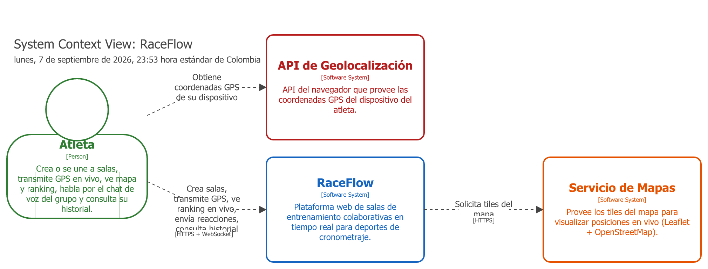
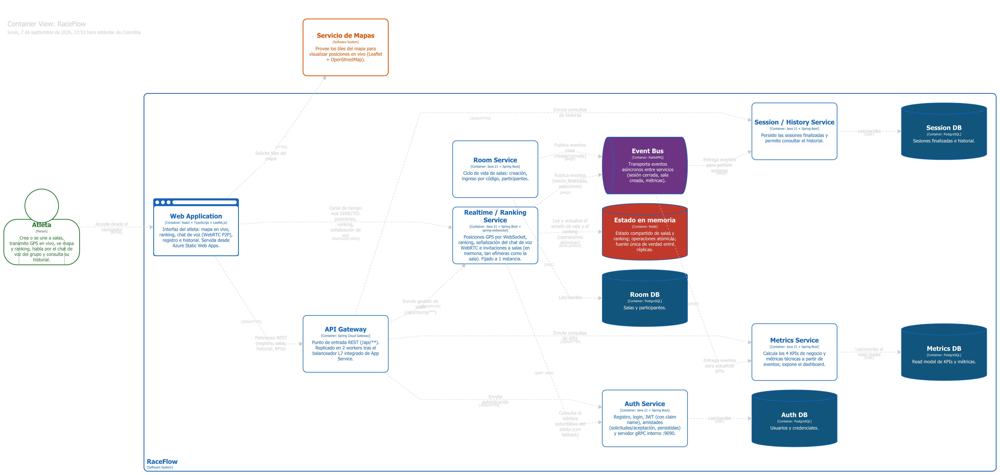
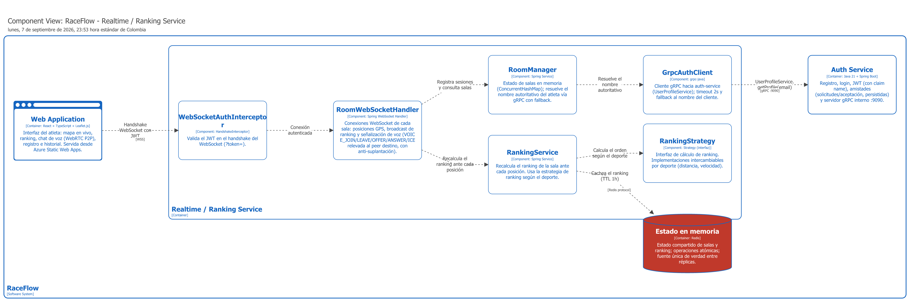

# RaceFlow — Documentación de Arquitectura (C4)

Diagramas de arquitectura del sistema usando el [modelo C4](https://c4model.com/),
generados a partir del modelo fuente en [`workspace.dsl`](workspace.dsl) con
[Structurizr](https://structurizr.com/) (imagen Docker `structurizr/structurizr`,
sucesora de la ya descontinuada Structurizr Lite). Los `.svg`/`.png` en `export/`
son la fuente real de los diagramas, exportados directamente desde el visor de
Structurizr para respetar la notación estándar de C4 (silueta de persona, cajas
con borde de color, sin relleno).

> Para el mapeo de los estilos de comunicación distribuida (sockets, HTTP, RMI, gRPC,
> microservicios, API Gateway) contra la arquitectura real de RaceFlow, ver
> [EVOLUCION_ARQUITECTONICA.md](EVOLUCION_ARQUITECTONICA.md).

## Diagramas exportados

### Nivel 1 — Contexto del sistema

> El Atleta interactúa con la plataforma RaceFlow a través de HTTPS y WebSocket.
> RaceFlow consume el Servicio de Mapas (OpenStreetMap) y la API de Geolocalización del navegador.



### Nivel 2 — Contenedores

> Detalla los contenedores desplegables: la SPA React, el API Gateway (Spring Cloud Gateway),
> los 5 microservicios Spring Boot, Redis, RabbitMQ y las 4 bases de datos PostgreSQL.



### Nivel 3 — Componentes del Realtime Service

> Zoom interno del servicio más crítico: `WebSocketAuthInterceptor` → `RoomWebSocketHandler`
> → `RoomManager` (resuelve nombre vía `GrpcAuthClient`) y → `RankingService` → `RankingStrategy`
> (Strategy), con el ranking cacheado en Redis.



---

## Editar y regenerar los diagramas

**Requisito:** Docker Desktop instalado.

1. Edita el modelo en `workspace.dsl` (elementos, relaciones, vistas, estilos).
2. Levanta Structurizr local, montando esta carpeta:

   ```bash
   docker run -d --name structurizr-local -p 8083:8080 -v "$(pwd)":/usr/local/structurizr structurizr/structurizr local
   ```

3. Abre `http://localhost:8083/workspace/1/diagrams` en el navegador y selecciona
   la vista (`Contexto`, `Contenedores`, `Componentes_Realtime`).
4. Usa el botón **Export as PNG** de la interfaz de Structurizr para descargar
   cada diagrama y reemplaza el `.png` correspondiente en `export/`. Si quieres
   conservar también el SVG editable, usa **Export as SVG**.
5. Si borras el contenedor y vuelves a montar la carpeta, elimina primero
   `workspace.json` (caché de Structurizr) para forzar que se regenere desde el
   `.dsl` actualizado:

   ```bash
   docker stop structurizr-local && docker rm structurizr-local
   rm -f workspace.json
   ```

## Vistas disponibles

| Vista | ID | Descripción |
|---|---|---|
| **System Context** | `Contexto` | Actores externos y relación de alto nivel con RaceFlow |
| **Containers** | `Contenedores` | SPA + Gateway + 5 microservicios + Redis + RabbitMQ + 4 DBs |
| **Component** | `Componentes_Realtime` | Componentes internos del Realtime/Ranking Service |

## Estructura

```
docs/architecture/
├── workspace.dsl       ← modelo C4 en DSL de Structurizr (fuente del modelo)
├── workspace.json       ← caché/estado resuelto de Structurizr (se regenera solo)
├── README.md           ← este archivo
└── export/
    ├── structurizr-Contexto.png
    ├── structurizr-Contexto.svg
    ├── structurizr-Contenedores.png
    ├── structurizr-Contenedores.svg
    ├── structurizr-Componentes_Realtime.png
    └── structurizr-Componentes_Realtime.svg
```

## Referencia rápida del DSL

| Elemento | Descripción |
|---|---|
| `softwareSystem` | Sistema completo o sistema externo |
| `container` | Proceso/aplicación desplegable dentro del sistema |
| `component` | Unidad de código dentro de un contenedor |
| `person` | Actor humano que interactúa con el sistema |
| `autoLayout lr` | Disposición automática izquierda → derecha |
| tag `"Database"` | Renderiza el shape como cilindro |
| tag `"Cache"` | Cilindro rojo (Redis) |
| tag `"Broker"` | Pipe (RabbitMQ) |
